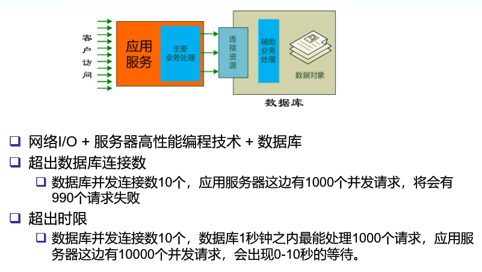
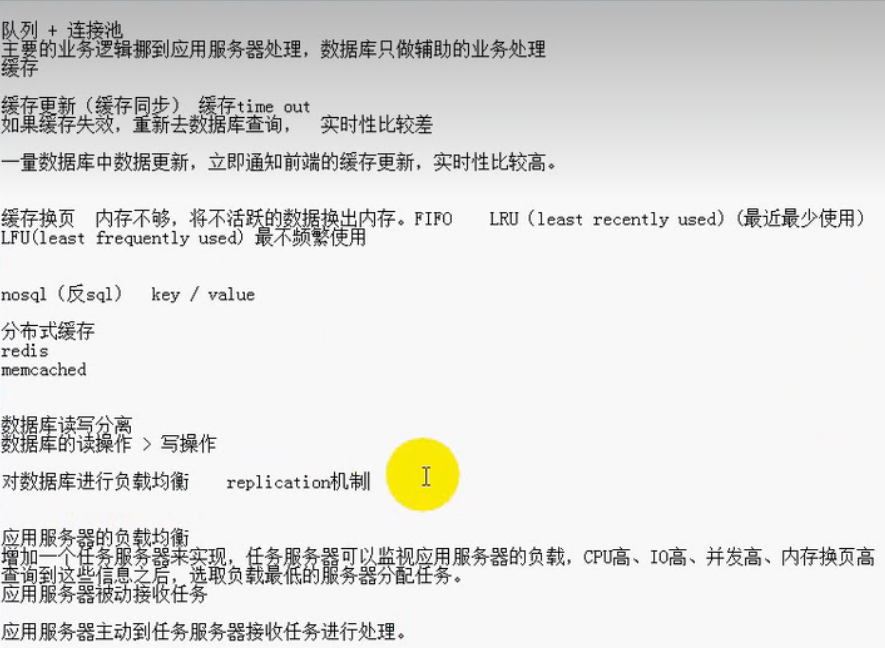
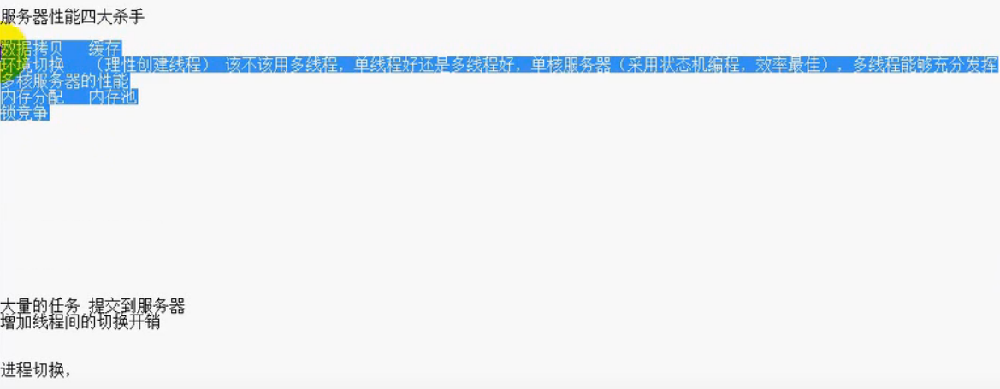
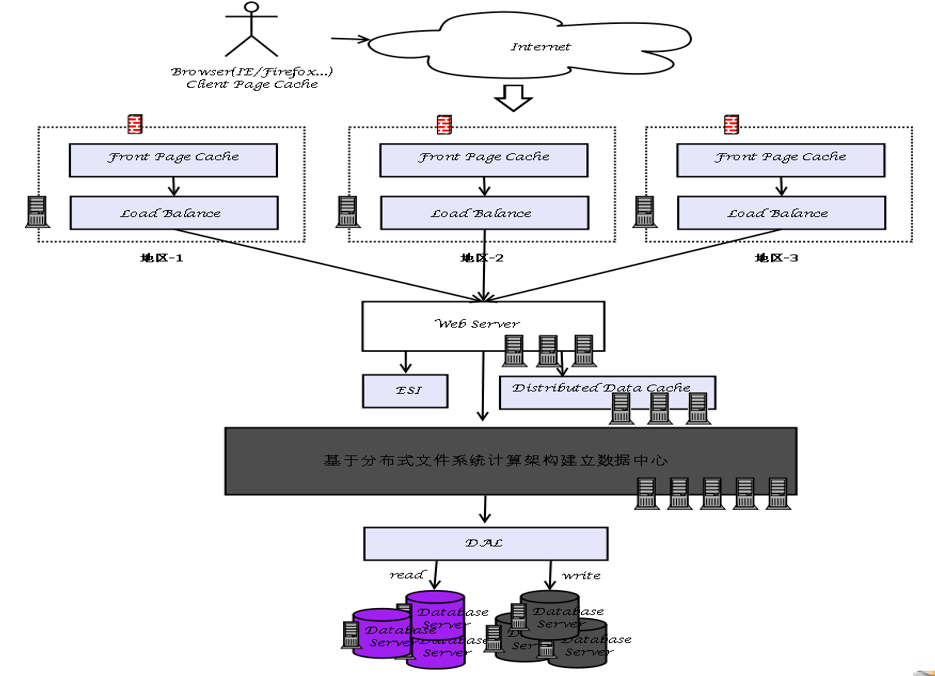
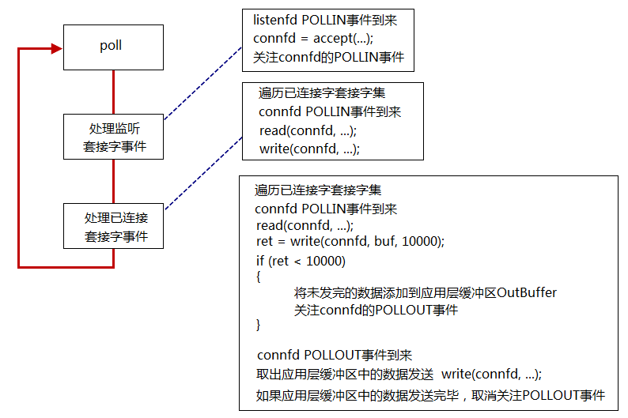

**前言：**记录学习视频[大并发服务器开发（实战）](https://www.bilibili.com/video/BV11b411q7zr/?spm_id_from=333.999.0.0&vd_source=93d2c7cab25a2966d2b5d0ccf80348c8)遇到的重难点，供以后自己进行复习。


# 一、大型并发服务器介绍

## [1.1 大并发服务器架构介绍](https://www.bilibili.com/video/BV11b411q7zr?p=1&vd_source=93d2c7cab25a2966d2b5d0ccf80348c8)

一个典型的服务器结构如下：

 






## 1.2 大型网站架构演变过程

**虽然看起来是 B/S 结构的，但是实际上 C/S 结构的。**



****

# 二、poll 和 epoll 原理

## 2.1 poll 原理

```c++
// 函数原型
#include <poll.h>
int poll(struct pollfd* fds, nfds_t fds, int timeout);

struct pollfd
{
  	int fd;			// 文件描述符
    short events;	// 请求事件
    short revents;	// 返回事件
};
```

**poll 使用的基本流程：**

* 此为玩具代码，因为 read 可能并没有把 connfd 所对应的接收缓冲区的数据都读完，那么 connfd 依然是活跃的。
* **数据包**：一个数据包，两次 read，这也被称为粘包现象。

我们应该将读到的数据保存在 connfd 的应用缓冲区。



**accept(2) 返回 EMFILE （太多文件了）的处理：**

* 调高进程文件描述符数目（治标不治本，因为整个系统资源是有限的）；
* 死等（效率较低）；
* 退出程序；
* 关闭监听套接字；

那什么时候重新打开呢？

* **如果是 epoll 模型，可以改用 edge trigger（边研触发，ET 模式）。**问题是如果漏掉了一次 accept(2)，程序再也不会收到新连接。
* **准备一个空闲的文件描述符（这是比较推荐的方式）。**遇到这种情况，先关闭这个空闲文件，获得一个文件描述符名额；再 accept(2) 拿到 socket 连接的文件描述符；随后立刻 close(2)，这样就优雅地断开了与客户端的连接；最后重新打开空闲文件，把“坑”填上，以备再次出现这种情况时使用。

## 2.2 epoll 原理

```c++
// epoll 相关的函数
#include <sys/epoll.h>
int epoll_create(int size);
int epoll_create1(int flags);

int epoll_ctl(int epfd, int op, int fd, struct epoll_event *event);
int epoll_wait(int epfd, struct epoll_event *events, int maxevents, int timeout);

typedef union epoll_data {
	void    *ptr;
	int      fd;
	uint32_t u32;
	uint64_t u64;
} epoll_data_t;

struct epoll_event 
{
	uint32_t     events;	/* Epoll events */
	epoll_data_t data;		/* User data variable */
};
```

**epoll 有两种触发模式：**

* LT 模式，水平触发模式
* ET 模式，边沿触发模式